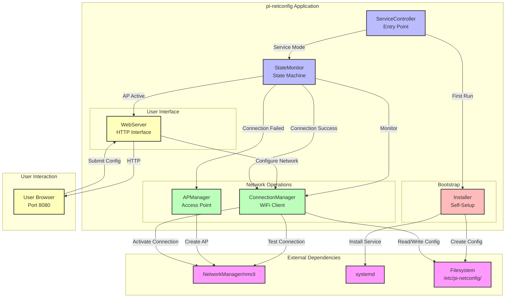

---
document_info:
  id: design-0000
  type: master_design
  iteration: 1
  tier: 1
  status: active
  coupled_docs:
    change_refs: []
    issue_refs: []
project_info:
  name: pi-netconfig
  version: 0.2.3
  date: 2025-12-03
  author: William Watson
metadata:
  copyright: Copyright (c) 2025 William Watson. This work is licensed under the MIT License.
  template_version: 1.0
  schema_type: t01_design
---

Created: 2025 November 11

# Pi Network Configuration Tool - Master Design

[Return to top](<#pi network configuration tool - master design>)

## Table of Contents

- [Scope](<#scope>)
- [System Overview](<#system overview>)
- [Design Constraints](<#design constraints>)
- [Architecture](<#architecture>)
- [Components](<#components>)
- [Data Design](<#data design>)
- [Interfaces](<#interfaces>)
- [Error Handling](<#error handling>)
- [Non-Functional Requirements](<#non-functional requirements>)
- [Version History](<#version history>)

[Return to top](<#pi network configuration tool - master design>)

## Scope

**Purpose:** Autonomous WiFi management service for Raspberry Pi that auto-configures network connectivity via web interface when no router connection exists.

**In Scope:**
- Self-installation as systemd service on first run
- WiFi connection detection and management
- Automatic AP mode activation for configuration
- Web-based configuration interface (port 8080)
- Systemd service integration
- Network scanning and selection
- Single network configuration persistence

**Out of Scope:**
- Ethernet configuration
- VPN management
- Network diagnostics beyond connectivity testing
- Multi-language support (English only)
- Mobile app interface
- Multiple network profile management
- Web interface authentication
- Status LED/notification system

**Terminology:**

| Term | Definition |
|------|------------|
| AP Mode | Access Point mode where device creates WiFi network for configuration |
| Client Mode | Standard mode where device connects to existing WiFi network |
| Network Manager | Linux system service managing network interfaces |

[Return to top](<#pi network configuration tool - master design>)

## System Overview

Self-installing service that monitors WiFi connectivity, switches between client/AP modes, and provides web interface for network configuration.

**Context Flow:**

```
First Run → Detect Service → [Not Installed] → Self-Install → Systemd Start → 
Boot → Connectivity Check → [No Connection] → AP Mode + Web Server → 
User Config → Client Mode
```

**Primary Functions:**
- Self-install as systemd service on first execution
- Monitor WiFi connection status
- Create temporary access point for configuration
- Scan and display available networks
- Configure WiFi credentials
- Persist configuration across reboots

[Return to top](<#pi network configuration tool - master design>)

## Design Constraints

### Technical Constraints

- Must work with NetworkManager (standard in Raspbian Bookworm)
- Requires root privileges for network operations
- Single WiFi interface constraint
- No external dependencies beyond standard Debian packages

### Implementation Details

**Language:** Python

**Framework:** asyncio for concurrent operations

**Libraries:**
- `http.server` (stdlib) - web interface
- `subprocess` - NetworkManager CLI interaction
- `json` - configuration persistence
- `socket` - connectivity testing

**Standards:**
- PEP 8 style compliance
- Type hints for all functions
- Systemd service unit specification

### Performance Targets

| Metric | Target |
|--------|--------|
| Connection detection | < 10 seconds after boot |
| AP mode activation | < 15 seconds after failed connection |
| Web interface response | < 500ms page load |

[Return to top](<#pi network configuration tool - master design>)

## Architecture

**Pattern:** Self-bootstrapping state machine with monitoring loop

**Component Relationships:**
```
Installer → [First Run] → ServiceController → StateMonitor → 
ConnectionManager ↔ APManager + WebServer
```

### Technology Stack

- **Language:** Python 3.11+
- **Framework:** asyncio event loop
- **Libraries:** NetworkManager via nmcli, http.server, systemd integration
- **Data Store:** JSON file (`/etc/pi-netconfig/config.json`)

### Directory Structure

| Path | Purpose |
|------|---------|
| `/opt/pi-netconfig/venv/` | Virtual environment (package installation) |
| `/etc/pi-netconfig/config.json` | Configuration files |
| `/var/log/pi-netconfig.log` | Service logs |
| `/etc/systemd/system/pi-netconfig.service` | Service unit (auto-generated) |

### System Diagram



**Diagram Legend:**
- **External Dependencies:** System services pi-netconfig relies upon
- **ServiceController:** Entry point handling bootstrap vs service mode
- **StateMonitor:** State machine coordinating CLIENT/AP_MODE transitions
- **ConnectionManager:** WiFi client operations (scan, connect, test)
- **APManager:** Access point creation for configuration mode
- **WebServer:** HTTP interface for network configuration (port 8080)
- **Installer:** Self-installation mechanism for systemd integration

**Data Flow:**
1. First run triggers Installer → creates systemd service
2. Service mode enters StateMonitor loop
3. ConnectionManager tests connectivity via NetworkManager
4. Connection failure triggers APManager + WebServer
5. User configures network via web interface
6. Configuration applied via ConnectionManager → NetworkManager
7. Success returns to CLIENT mode monitoring

[Return to top](<#pi network configuration tool - master design>)

## Components

### Installer

**Purpose:** Self-installation mechanism for venv-based package deployment with systemd integration

**Responsibilities:**
- Detect if systemd service already installed
- Validate virtual environment execution context
- Validate package installation in venv
- Create required directories (`/etc/pi-netconfig`, logs)
- Generate venv-aware systemd unit file
- Enable and start systemd service
- Verify installation success

**Inputs:**
- `run_mode` (str): bootstrap or service mode indicator

**Outputs:**
- `installation_status` (bool): Installation success/failure

**Key Elements:**
- `InstallationDetector` (class): Check for existing systemd service installation
- `VenvDetector` (class): Validate venv context and package installation
- `SystemdInstaller` (class): Generate venv-aware systemd unit, perform installation

**Dependencies:**
- External: `subprocess` (systemctl), `sys` (venv detection), `os` (path operations)

**Processing Logic:**
- Check for service file: `/etc/systemd/system/pi-netconfig.service`
- If exists: exit installer, proceed to normal operation
- If not exists and root privileges: begin installation
- Validate venv context: `sys.prefix != sys.base_prefix`
- Validate package installed: `import pi_netconfig` succeeds
- Extract venv Python path: `sys.executable`
- Create directories: `/etc/pi-netconfig/`, `/var/log/`
- Generate systemd unit with venv Python: `ExecStart={venv_python} -m pi_netconfig.service_controller`
- Install unit: write to `/etc/systemd/system/`
- Enable: `systemctl daemon-reload && systemctl enable pi-netconfig`
- Start: `systemctl start pi-netconfig`
- Exit bootstrap mode (systemd will restart in service mode)

**Error Conditions:**

| Condition | Handling |
|-----------|----------|
| Insufficient privileges (not root) | Raise PrivilegeError: 'Installation requires root privileges' |
| Not in virtual environment | Raise InstallerError: 'Must execute within virtual environment' |
| Package not installed | Raise InstallerError: 'Package pi_netconfig not installed in venv' |
| Directory creation fails | Raise FileSystemError with details, rollback partial installation |
| Systemd commands fail | Log error details, attempt rollback |

[Return to top](<#pi network configuration tool - master design>)

### StateMonitor

**Purpose:** Main state machine managing service operational mode

**Responsibilities:**
- Determine current operational state (CHECKING, CLIENT, AP_MODE)
- Coordinate transitions between states
- Initialize and shutdown components

**Inputs:**
- `connection_status` (bool): Result from connectivity check

**Outputs:**
- `current_state` (Enum[CHECKING, CLIENT, AP_MODE]): Current operational state

**Key Elements:**
- `StateMachine` (class): Implement state transitions and mode coordination

**Dependencies:**
- Internal: ConnectionManager, APManager, WebServer
- External: asyncio

**Processing Logic:**
- Loop: check connection every 30 seconds
- On boot or connection loss: transition to AP_MODE after 3 failed checks
- In AP_MODE: monitor for successful configuration
- After config: attempt connection, return to CLIENT or remain AP_MODE

**Error Conditions:**

| Condition | Handling |
|-----------|----------|
| State transition failure | Log error, attempt recovery to last known good state |

[Return to top](<#pi network configuration tool - master design>)

### ConnectionManager

**Purpose:** Manage WiFi client mode connections and scanning

**Responsibilities:**
- Test active connection to router/AP
- Scan for available networks
- Configure and activate WiFi connections
- Persist connection configurations

**Inputs:**
- `ssid` (str): Network SSID to connect
- `password` (str): Network PSK

**Outputs:**
- `connection_active` (bool): Connection status result
- `available_networks` (List[NetworkInfo]): Scanned networks with signal strength

**Key Elements:**
- `ConnectionTester` (class): Verify active internet connectivity
- `NetworkScanner` (class): Scan and parse available WiFi networks
- `ConfigManager` (class): Apply and persist NetworkManager configurations

**Dependencies:**
- External: `subprocess` (nmcli), `socket` (connectivity test)

**Processing Logic:**
- Test connection: ping known hosts (8.8.8.8, 1.1.1.1)
- Scan: `nmcli dev wifi list`
- Configure: `nmcli connection add/modify`
- Persist to JSON: active SSID and credentials

**Error Conditions:**

| Condition | Handling |
|-----------|----------|
| nmcli command fails | Raise ConnectionManagerError with stderr output |
| Invalid credentials | Return error status, maintain previous config |

[Return to top](<#pi network configuration tool - master design>)

### APManager

**Purpose:** Create and manage local access point for configuration

**Responsibilities:**
- Activate WiFi interface in AP mode
- Configure DHCP for connected clients
- Provide predictable SSID and credentials
- Deactivate AP when switching to client mode

**Inputs:**
- `enable` (bool): Activate or deactivate AP mode

**Outputs:**
- `ap_active` (bool): Current AP mode status
- `ap_ssid` (str): Access point network name

**Key Elements:**
- `AccessPoint` (class): Manage NetworkManager AP connection profile

**Dependencies:**
- External: `subprocess` (nmcli)

**Processing Logic:**
- Create AP profile: SSID='PiConfig-<MAC_LAST_4>', WPA2, password='piconfig123'
- Activate: `nmcli connection up <profile>`
- Deactivate: `nmcli connection down <profile>`
- IP range: 192.168.50.1/24

**Error Conditions:**

| Condition | Handling |
|-----------|----------|
| AP activation fails | Raise APManagerError, attempt fallback to open AP |
| Interface unavailable | Log critical error, enter degraded mode |

[Return to top](<#pi network configuration tool - master design>)

### WebServer

**Purpose:** Provide HTTP interface for network configuration

**Responsibilities:**
- Serve HTML configuration interface
- Handle network scan requests
- Process configuration submissions
- Provide API endpoints for status queries

**Inputs:**
- `http_request` (HTTPRequest): Incoming web requests

**Outputs:**
- `http_response` (HTTPResponse): HTML pages or JSON API responses

**Key Elements:**
- `ConfigHTTPHandler` (class): Custom HTTP request handler
- `APIEndpoints` (class): REST-like API for AJAX calls

**Dependencies:**
- Internal: ConnectionManager, StateMonitor
- External: `http.server`, `json`

**Processing Logic:**
- Serve static HTML/CSS/JS from embedded strings
- `GET /`: main configuration page
- `GET /api/scan`: trigger network scan, return JSON
- `POST /api/configure`: accept SSID/password, apply config
- `GET /api/status`: return current state and connection info

**Error Conditions:**

| Condition | Handling |
|-----------|----------|
| Port 8080 unavailable | Raise WebServerError, log and exit service |
| Invalid configuration POST | Return 400 with error details in JSON |

[Return to top](<#pi network configuration tool - master design>)

### ServiceController

**Purpose:** Application entry point managing bootstrap vs service mode and systemd lifecycle

**Responsibilities:**
- Determine execution mode (bootstrap vs service)
- Delegate to Installer if not installed
- Initialize logging
- Start/stop state monitor loop
- Handle service signals (SIGTERM, SIGINT)
- Cleanup on shutdown

**Inputs:**
- `system_signal` (signal): OS signals for service control
- `execution_context` (str): Detected run mode

**Outputs:**
- `exit_code` (int): Service exit status

**Key Elements:**
- `ServiceMain` (function): Entry point for application, routes to installer or service loop

**Dependencies:**
- Internal: Installer, StateMonitor, All other components
- External: `logging`, `signal`, `systemd`, `os` (privilege detection)

**Processing Logic:**
- Detect execution mode: check if running under systemd or manual invocation
- If systemd service not installed: invoke Installer and exit
- If installed: proceed with normal service operation
- Setup logging to `/var/log/pi-netconfig.log`
- Register signal handlers for graceful shutdown
- Initialize StateMonitor and start event loop
- On shutdown: deactivate AP, close web server, exit cleanly

**Error Conditions:**

| Condition | Handling |
|-----------|----------|
| Insufficient privileges for service mode | Log critical error, exit with code 1 |
| Unhandled exception | Log traceback, attempt cleanup, exit with code 1 |

[Return to top](<#pi network configuration tool - master design>)

## Data Design

### Entities

#### NetworkInfo

**Purpose:** Represent scanned WiFi network

**Attributes:**

| Name | Type | Constraints |
|------|------|-------------|
| ssid | str | non-empty |
| signal_strength | int | 0-100 |
| security | str | enum: WPA2, WPA3, Open |
| frequency | str | 2.4GHz or 5GHz |

#### ConfigurationData

**Purpose:** Persist single network configuration

**Attributes:**

| Name | Type | Constraints |
|------|------|-------------|
| configured_ssid | str | nullable, last successful connection only |
| timestamp | datetime | ISO 8601 format |

### Storage

#### /etc/pi-netconfig/config.json

**Fields:**

| Name | Type | Constraints |
|------|------|-------------|
| configured_ssid | string | nullable |
| last_connected | string (ISO datetime) | nullable |
| ap_password | string | default: piconfig123 |

### Validation Rules

- SSID length: 1-32 characters
- Password length: 8-63 characters for WPA2
- No special shell characters in credentials

[Return to top](<#pi network configuration tool - master design>)

## Interfaces

### Internal Interfaces

#### test_connection

**Purpose:** Verify active internet connectivity

**Signature:** `async def test_connection() -> bool`

**Returns:** `bool` - True if connection active

**Raises:**
- `ConnectionManagerError`: Unable to perform connectivity test

#### scan_networks

**Purpose:** Scan for available WiFi networks

**Signature:** `async def scan_networks() -> List[NetworkInfo]`

**Returns:** `List[NetworkInfo]` - Available networks sorted by signal strength

**Raises:**
- `ConnectionManagerError`: Scan operation fails

#### configure_network

**Purpose:** Apply WiFi configuration

**Signature:** `async def configure_network(ssid: str, password: str) -> bool`

**Parameters:**
- `ssid` (str): Target network SSID
- `password` (str): Network password

**Returns:** `bool` - True if configuration successful

**Raises:**
- `ConnectionManagerError`: Configuration fails

#### activate_ap

**Purpose:** Enable access point mode

**Signature:** `async def activate_ap() -> bool`

**Returns:** `bool` - True if AP activated successfully

**Raises:**
- `APManagerError`: AP activation fails

### External Interfaces

#### Web API

**Protocol:** HTTP/1.1

**Data Format:** JSON

**Specification:**

```
GET /api/scan 
→ {"networks": [{"ssid": str, "signal": int, "security": str}]}

POST /api/configure 
{"ssid": str, "password": str} 
→ {"success": bool, "message": str}

GET /api/status 
→ {"state": str, "ssid": str|null, "ap_active": bool}
```

[Return to top](<#pi network configuration tool - master design>)

## Error Handling

### Exception Hierarchy

**Base:** `PiNetConfigError`

**Specific:**
- `InstallerError`
- `ConnectionManagerError`
- `APManagerError`
- `WebServerError`
- `ConfigurationError`

### Strategy

| Error Type | Handling |
|------------|----------|
| Validation errors | Return descriptive message via web interface, log warning |
| Runtime errors | Log with traceback, attempt recovery to known state |
| External failures | Retry with exponential backoff, fallback to degraded mode |

### Logging

**Levels:**
- **DEBUG:** state transitions, nmcli commands
- **INFO:** connection status changes, configuration updates
- **WARNING:** failed connection attempts, retries
- **ERROR:** component failures, unrecoverable errors
- **CRITICAL:** service shutdown due to error

**Required Info:**
- Timestamp
- Log level
- Component name
- Message
- Stack trace (for errors)

**Format:** `%(asctime)s - %(name)s - %(levelname)s - %(message)s`

[Return to top](<#pi network configuration tool - master design>)

## Non-Functional Requirements

### Performance

| Metric | Target |
|--------|--------|
| Boot to ready | < 30 seconds |
| Network scan | < 5 seconds |
| Configuration application | < 10 seconds |

### Security

**Authentication:** None - local network access only

**Authorization:** Root privileges required for service

**Data Protection:**
- WiFi passwords stored in NetworkManager secure storage
- Configuration file readable only by root
- No credential logging

### Reliability

**Error Recovery:** Automatic recovery to AP mode on repeated failures

**Fault Tolerance:**
- Continue operation if single component fails
- Graceful degradation if WiFi hardware unavailable

### Maintainability

**Code Organization:**
- Single-file implementation for simplicity
- Clear separation of concerns via classes
- Type hints throughout

**Documentation:**
- Docstrings for all public methods
- Self-installation guide (run as root on first execution)
- Systemd service management instructions

**Testing:**
- Coverage target: 80%
- Unit tests for state transitions
- Mock NetworkManager for integration tests
- Manual end-to-end testing on Raspberry Pi

[Return to top](<#pi network configuration tool - master design>)

## Version History

### v0.2.3 (2025-12-03)

**Author:** William Watson

**Changes:**
- Updated per [change-0013](<../change/change-0013-installer-venv-deployment.md>): Redesigned Installer for venv-based package deployment
- Added VenvDetector class for virtual environment validation
- Removed script file copying (package in site-packages)
- Updated systemd unit generation for module execution with venv Python
- Updated directory structure to reflect venv deployment model

### v0.2.2 (2025-11-28)

**Author:** William Watson

**Changes:**
- Converted document from YAML format to markdown with YAML frontmatter
- Added system architecture diagram per audit recommendation MD-001 from [audit-0002](<../audit/audit-0002-governance-compliance-v4.md>)
- Comprehensive Mermaid diagram showing module relationships, data flow, and external dependencies

### v0.2.1 (2025-11-20)

**Author:** William Watson

**Changes:**
- Updated per [change-0002](<../change/change-0002-periodic-audits.md>): Governance framework now includes P08 Audit protocol for systematic compliance verification
- Updated per [change-0003](<../change/change-0003-governance-scope-clarification.md>): Clarified that Domain 1/2 architecture model describes development workflow, not runtime system architecture
- Updated per [change-0004](<../change/change-0004-version-synchronization.md>): Synchronized pyproject.toml version to match design version 0.2.0

### v0.2.0 (2025-11-10)

**Author:** William Watson

**Changes:**
- Added Installer module for self-installation as systemd service
- Updated ServiceController to handle bootstrap vs service mode
- Modified architecture to self-bootstrapping pattern
- Added InstallerError exception type

### v0.1.1 (2025-11-10)

**Author:** William Watson

**Changes:**
- Clarified single network configuration approach
- Removed web authentication requirement
- Removed LED/notification system from scope

### v0.1.0 (2025-11-10)

**Author:** William Watson

**Changes:**
- Initial master design document

[Return to top](<#pi network configuration tool - master design>)
