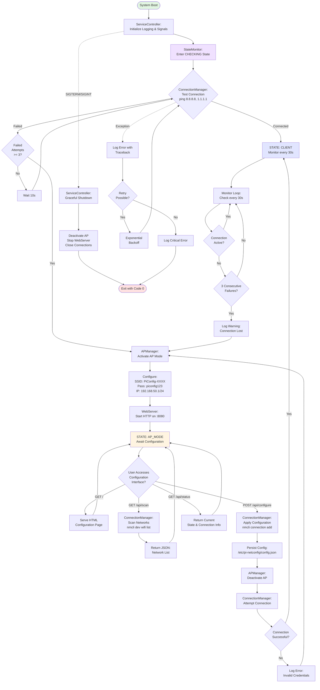

Created: 2025 November 11

# Pi Network Configuration Tool - System Flow Diagram

## Table of Contents

[Purpose](<#purpose>)
[Overview](<#overview>)
[System Flow Diagram](<#system flow diagram>)
[Flow Description](<#flow description>)
  - [Boot Sequence](<#boot sequence>)
  - [State Transitions](<#state transitions>)
  - [Client Mode Operation](<#client mode operation>)
  - [AP Mode Operation](<#ap mode operation>)
  - [Configuration Flow](<#configuration flow>)
  - [Error Handling](<#error handling>)
[Related Design Documents](<#related design documents>)
[Version History](<#version history>)

---

## Purpose

This document provides a comprehensive visual representation of the Pi Network Configuration Tool's operational flow, illustrating the interactions between core components and the system's state machine behavior.

[Return to Table of Contents](<#table of contents>)

## Overview

The system flow diagram maps the complete lifecycle of the network configuration tool, from boot initialization through state transitions, monitoring loops, configuration operations, and error recovery procedures. This visualization complements the master design document by showing the dynamic runtime behavior of the system.

**Source Design**: [Master Design](<design-0000-master.md>)

[Return to Table of Contents](<#table of contents>)

## System Flow Diagram

[Return to Table of Contents](<#table of contents>)

## Flow Description

### Boot Sequence

1. **System Boot**: ServiceController initializes logging and signal handlers
2. **State Initialization**: StateMonitor enters CHECKING state
3. **Connection Test**: ConnectionManager attempts to verify internet connectivity

### State Transitions

The system operates in two primary states:

**CLIENT Mode**: System has active WiFi connection and monitors connectivity every 30 seconds

**AP_MODE**: System creates temporary access point for configuration when no connection available

### Client Mode Operation

- Connection monitor runs every 30 seconds
- Tests connectivity via ping to external hosts
- Tracks consecutive failures
- Transitions to AP mode after 3 consecutive failures

### AP Mode Operation

- APManager activates access point with SSID format `PiConfig-XXXX`
- WebServer starts on port 8080
- System awaits user configuration via web interface
- Four API endpoints available:
  - `GET /` - Configuration HTML page
  - `GET /api/scan` - Network scan results
  - `POST /api/configure` - Apply network settings
  - `GET /api/status` - Current system state

### Configuration Flow

1. User submits network credentials via web interface
2. Configuration persisted to `/etc/pi-netconfig/config.json`
3. APManager deactivates access point
4. ConnectionManager attempts connection with new credentials
5. On success: transition to CLIENT mode
6. On failure: log error and return to AP mode

### Error Handling

- All exceptions logged with traceback
- Exponential backoff for retryable errors
- Critical errors trigger graceful shutdown
- Signal handlers (SIGTERM/SIGINT) ensure clean deactivation

[Return to Table of Contents](<#table of contents>)

## Related Design Documents

- [Master Design](<design-0000-master.md>) - Complete system architecture
- [StateMonitor Design](<design-0002-statemonitor.md>) - State machine implementation
- [ConnectionManager Design](<design-0003-connectionmanager.md>) - Network operations
- [APManager Design](<design-0004-apmanager.md>) - Access point management
- [WebServer Design](<design-0005-webserver.md>) - HTTP interface
- [ServiceController Design](<design-0006-servicecontroller.md>) - Service lifecycle
- [Systemd Service Diagram](<design-0008-systemd-service-diagram.md>) - Service integration

[Return to Table of Contents](<#table of contents>)

## Version History

| Version | Date | Author | Changes |
|---------|------|--------|---------|
| 1.0 | 2025-11-11 | William Watson | Initial creation |

[Return to Table of Contents](<#table of contents>)

---

Copyright: Copyright (c) 2025 William Watson. This work is licensed under the MIT License.
