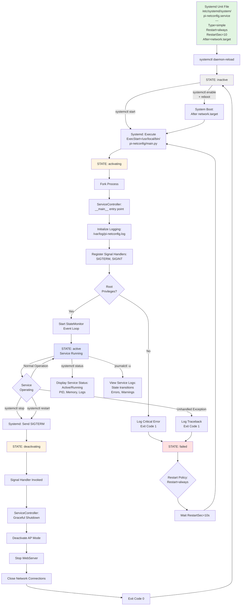

Created: 2025 November 11

# Pi Network Configuration Tool - Systemd Service Lifecycle

## Table of Contents

[Purpose](<#purpose>)
[Overview](<#overview>)
[Systemd Service Lifecycle Diagram](<#systemd service lifecycle diagram>)
[Lifecycle Description](<#lifecycle description>)
  - [Service Unit Configuration](<#service unit configuration>)
  - [Service States](<#service states>)
  - [Activation Sequence](<#activation sequence>)
  - [Deactivation Sequence](<#deactivation sequence>)
  - [Restart Policy](<#restart policy>)
  - [Service Management](<#service management>)
[Related Design Documents](<#related design documents>)
[Version History](<#version history>)

---

## Purpose

This document provides a visual representation of the Pi Network Configuration Tool's systemd service lifecycle, illustrating the integration between systemd and the ServiceController component.

[Return to Table of Contents](<#table of contents>)

## Overview

The systemd service lifecycle diagram shows the complete service management flow, from unit file installation through state transitions, signal handling, and automatic restart policies. This visualization complements the system flow diagram by focusing on the service integration layer.

**Source Design**: [Master Design](<design-0000-master.md>)

[Return to Table of Contents](<#table of contents>)

## Systemd Service Lifecycle Diagram

[Return to Table of Contents](<#table of contents>)

## Lifecycle Description

### Service Unit Configuration

The systemd unit file defines critical service parameters:

- **Type**: `simple` - Process runs in foreground
- **Restart**: `always` - Automatic restart on all exit conditions
- **RestartSec**: 10 seconds delay between restart attempts
- **After**: `network.target` - Ensures network subsystem available before start

### Service States

The service transitions through standard systemd states:

1. **inactive**: Service stopped, not running
2. **activating**: Service starting, initialization in progress
3. **active**: Service running normally
4. **deactivating**: Service stopping, cleanup in progress
5. **failed**: Service exited with error code

### Activation Sequence

1. systemd executes `ExecStart` command
2. Process forked and ServiceController `__main__` invoked
3. Logging infrastructure initialized
4. Signal handlers registered (SIGTERM, SIGINT)
5. Root privilege verification
6. StateMonitor event loop started
7. Service transitions to active state

### Deactivation Sequence

1. systemd sends SIGTERM signal
2. Signal handler catches termination request
3. ServiceController initiates graceful shutdown:
   - Deactivate AP mode if active
   - Stop WebServer
   - Close network connections
4. Process exits with code 0
5. Service transitions to inactive state

### Restart Policy

The `Restart=always` policy ensures service resilience:

- Unhandled exceptions trigger automatic restart
- 10-second delay prevents rapid restart loops
- Service returns to activation sequence after delay
- Failed state transitions back to activating state

### Service Management

Common systemctl commands:

- `systemctl start pi-netconfig` - Manual service start
- `systemctl stop pi-netconfig` - Graceful service stop
- `systemctl restart pi-netconfig` - Stop and start sequence
- `systemctl enable pi-netconfig` - Enable boot-time activation
- `systemctl status pi-netconfig` - Display service status
- `journalctl -u pi-netconfig` - View service logs

[Return to Table of Contents](<#table of contents>)

## Related Design Documents

- [Master Design](<design-0000-master.md>) - Complete system architecture
- [Installer Design](<design-0001-installer.md>) - Service installation procedures
- [ServiceController Design](<design-0006-servicecontroller.md>) - Service lifecycle management
- [System Flow Diagram](<design-0007-system-flow-diagram.md>) - Operational flow

[Return to Table of Contents](<#table of contents>)

## Version History

| Version | Date | Author | Changes |
|---------|------|--------|---------|
| 1.0 | 2025-11-11 | William Watson | Initial creation |

[Return to Table of Contents](<#table of contents>)

---

Copyright: Copyright (c) 2025 William Watson. This work is licensed under the MIT License.
